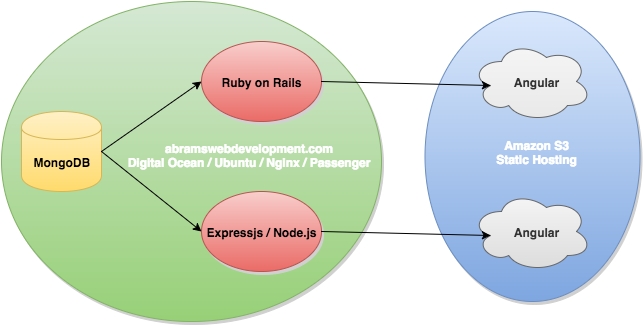

# Angular Double Backend
#### An angular app with a fun twist!

Two identical static angular apps were deployed separately to Amazon S3:
- http://angular-cart.s3-website-us-west-2.amazonaws.com
- http://rails-cart.s3-website-us-west-2.amazonaws.com

One talks to an express backend, and the other talks to a rails backend, both deployed to a Digital Ocean VM.

Each backend talks to the same MongoDB.  Expressjs uses Mongoose, Rails uses Mongoid.  Check out the repos and figure below!

- https://github.com/sabrams86/angular-cart
- https://github.com/sabrams86/rails-shopping-cart
- https://github.com/sabrams86/mean-shopping-cart

